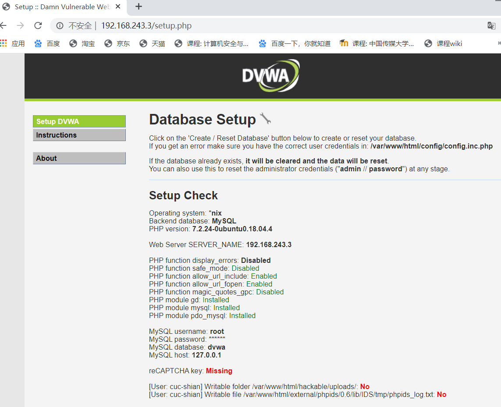
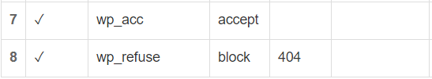
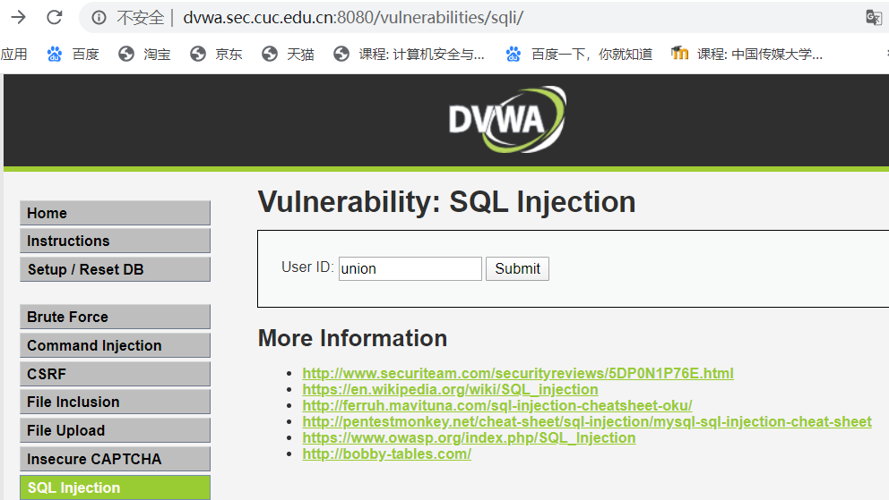

# 第五章实验报告

## 1.实验环境
- Nginx
- VeryNginx
- Wordpress 4.7
- Damn Vulnerable Web Application (DVWA)

***

### 安装Nginx
```bash
#安装Nginx
sudo apt install nginx

#Nginx默认端口为80，需要将Apache2端口改成其他端口，以免Nginx因为端口被占用而无法启动

#启动nginx 
sudo systemctl start nginx.service
```

- 安装完成后，通过```http://ip:80/```即可访问


***

### 安装VeryNginx
```bash
#安装VeryNginx
git clone https://github.com/alexazhou/VeryNginx.git
sudo apt install libssl-dev libpcre3 libpcre3-dev build-essential
cd VeryNginx
sudo python install.py install

#根据报错安装以下依赖
sudo apt-get install libssl-dev
sudo apt-get install openssl
sudo apt-get install libpcre3 libpcre3-dev
sudo apt-get install build-essential
sudo apt-get install make
sudo apt-get install gcc
sudo apt-get install zlib1g-dev

#重新安装
sudo python install.py install

#修改nginx.conf配置文件
sudo vim /opt/verynginx/openresty/nginx/conf/nginx.conf
#将user从nginx修改为root
#修改server监听端口为8080
#保存退出

#启动VeryNginx服务
sudo /opt/verynginx/openresty/nginx/sbin/nginx
```

- 在windows主机hosts文件中添加一条对应的DNS解析```192.168.243.3 vn.sec.cuc.edu.cn```，即可使用域名访问verynginx
- 启动verynginx，在浏览器中访问```http://vn.sec.cuc.edu.cn//verynginx/index.html:8080``` 如果访问成功，证明verynginx已经安装完成。默认用户名和密码是 ```verynginx``` / ```verynginx```，登录之后就可以查看状态，并对配置进行修改。


***

### 安装Wordpress

- 安装mysql，并为搭建Wordpress做配置
    ```bash
    #下载安装mysql数据库
    sudo apt install mysql-server
    
    #登录mysql的root账户
    mysql -u root -p
    ```
    ```sql
    #创建wordpress数据库
    CREATE DATABASE wordpress DEFAULT CHARACTER SET utf8 COLLATE utf8_unicode_ci;
    
    #创建wordpressuser账户，授予访问权限并设置密码
    GRANT ALL ON wordpress.* TO 'wordpressuser'@'localhost' IDENTIFIED BY 'password';
    
    #刷新权限
    FLUSH PRIVILEGES;
    
    #退出mysql
    EXIT;
    ```

- 安装php7.0
    ```bash
    #安装php7.0
    sudo apt install php7.0
    
    #安装一些php扩展
    sudo apt install php-curl php-gd php-mbstring php-mcrypt php-xml php-xmlrpc
    
    #重新启动php-fpm进程
    sudo systemctl restart php7.2-fpm
    ```

- 配置Nginx
    ```bash
    sudo vim /etc/nginx/sites-available/default
    ```

    -   添加一些```location```块
        ```bash
        server {
        . . .
        location = /favicon.ico { log_not_found off; access_log off; }
        location = /robots.txt { log_not_found off; access_log off; allow all; }
        location ~* \.(css|gif|ico|jpeg|jpg|js|png)$ {
            expires max;
            log_not_found off;
            }
        . . .
        }
        ```

    -   调整```try_files```列表
        ```bash
        server {
        . . .
        location / {
            #try_files $uri $uri/ =404;
            try_files $uri $uri/ /index.php$is_args$args;
            }
        . . .
        }
        ```

    -   检查配置中的语法错误
        ```bash
        sudo nginx -t
        ```

    -   如果没有错误报告，则重新加载Nginx
        ```bash
        sudo systemctl restart nginx.service
        ```

- 下载wordpress4.7安装包
    ```bash
    #下载安装包
    sudo wget https://wordpress.org/wordpress-4.7.zip
    
    #解压安装包
    unzip wordpress-4.7.zip
    
    #将示例配置文件复制到WordPress实际读取的文件名
    sudo cp /wordpress/wp-config-sample.php /wordpress/wp-config.php
    
    #将解压后的wordpress移到指定路径
    sudo mkdir /var/www/html/wp.sec.cuc.edu.cn
    sudo cp -r wordpress/* /var/www/html/wp.sec.cuc.edu.cn
    
    #分配权限
    sudo chown -R root:root /var/www/html/wp.sec.cuc.edu.cn
    ```

- 设置WordPress配置文件
    -   从WordPress密钥生成器获取安全值
        ```bash
        curl -s https://api.wordpress.org/secret-key/1.1/salt/
        ```
    -   将获取的配置行复制到配置文件中
        ```bash
        #打开配置文件
        sudo vim /var/www/html/wp.sec.cuc.edu.cn/wp-config.php
        ```
        ```bash
        #用获取的配置行替换配置文件中下值
        . . .
        define('AUTH_KEY',         'VALUES COPIED FROM THE COMMAND LINE');
        define('SECURE_AUTH_KEY',  'VALUES COPIED FROM THE COMMAND LINE');
        define('LOGGED_IN_KEY',    'VALUES COPIED FROM THE COMMAND LINE');
        define('NONCE_KEY',        'VALUES COPIED FROM THE COMMAND LINE');
        define('AUTH_SALT',        'VALUES COPIED FROM THE COMMAND LINE');
        define('SECURE_AUTH_SALT', 'VALUES COPIED FROM THE COMMAND LINE');
        define('LOGGED_IN_SALT',   'VALUES COPIED FROM THE COMMAND LINE');
        define('NONCE_SALT',       'VALUES COPIED FROM THE COMMAND LINE');
        . . .
        ```
        ```bash
        #将wordpress数据库的相关信息填入
        . . .
        define('DB_NAME', 'wordpress');

        /** MySQL database username */
        define('DB_USER', 'wordpressuser');

        /** MySQL database password */
        define('DB_PASSWORD', 'password');
        . . .

        #添加
        define('FS_METHOD', 'direct');

- 在浏览器中访问ip地址，即可完成WordPress的安装


***

### 安装DVWA
- 下载DVWA，并移动到指定文件夹
    ```bash
    sudo git clone https://github.com/ethicalhack3r/DVWA /tmp/DVWA
    sudo mv -r /tmp/DVWA /var/www/html/
    ```

- 配置文件重命名
    ```bash
    cp /var/www/html/config/config.inc.php.dist /var/www/html/config/config.inc.php
    ```

- 配置文件里修改密码
    ```bash
    #打开配置文件
    vim /var/www/html/config/config.inc.php

    #自行修改/默认不改
    $_DVWA[ 'db_password' ] = 'p@ssw0rd'
    ```

- 编辑php文件
    ```bash
    #打开文件
    sudo vim /etc/php/7.2/apache2/php.ini

    #找到对应行修改
    allow_url_include = on
    allow_url_fopen = on
    display_errors = off
    ```

- 分配权限
    ```bash
    chown -R root.root /var/www/html/

- 通过ip地址访问

1. 对应修改相关缺失
    - reCAPTCHA密钥：丢失
        - 编辑/var/www/html/config/config.inc.php并为其设置值
        - ```$_DVWA[ 'recaptcha_public_key' ] = 'PASTE YOUR PUBLIC KEY HERE';```
        - ```$_DVWA[ 'recaptcha_private_key' ] = 'PASTE YOUR SECRET KEY HERE';```

2. 对应文件夹授予权限

3. 完成配置后，重新启动Apache和MySQL
```bash
sudo systemctl restart apache2.service
sudo systemctl restart mysql.service
```
4. 重新访问网页并创建


***

## 2.实验检查点

### 基本要求
1. 在一台主机（虚拟机）上同时配置Nginx和VeryNginx
    - VeryNginx作为本次实验的Web App的反向代理服务器和WAF
    - PHP-FPM进程的反向代理配置在nginx服务器上，VeryNginx服务器不直接配置Web站点服务

- 修改nginx配置，wordpress监听127.0.0.1:80，dvwa监听127.0.0.1:5566
- 在verynginx网页中配置
    - 配置matcher
        
    - 配置upstream和proxy
        
    - 配置完成拓扑图    
        

2. 使用Wordpress搭建的站点对外提供访问的地址为： `http://wp.sec.cuc.edu.cn`
```bash
#在Ubuntu中，修改/etc/nginx/sites-available/default的server_name
server_name wp.sec.cuc.edu.cn;

#重启Nginx以应用配置
sudo systemctl restart nginx.service

#在/etc/hosts中添加
192.168.243.3 wp.sec.cuc.edu.cn

#在本机C:\Windows\System32\drivers\etc\hosts中添加同样的内容
# 需要管理员权限
192.168.243.3 wp.sec.cuc.edu.cn
```


3. 使用Damn Vulnerable Web Application (DVWA)搭建的站点对外提供访问的地址为：`http://dvwa.sec.cuc.edu.cn`
```bash
#在Ubuntu中，修改/etc/nginx/sites-available/default的server_name
server_name dvwa.sec.cuc.edu.cn;

#重启Nginx以应用配置
sudo systemctl restart nginx.service

#在/etc/hosts中添加
192.168.243.3 dvwa.sec.cuc.edu.cn

#在本机C:\Windows\System32\drivers\etc\hosts中添加同样的内容
# 需要管理员权限
192.168.243.3 dvwa.sec.cuc.edu.cn
```


***

### 安全加固要求
- 使用IP地址方式均无法访问上述任意站点，并向访客展示自定义的友好错误提示信息页面-1
    - 添加matcher
        
    - 添加response
        
    - 添加filter
        
    - 结果
        

- Damn Vulnerable Web Application (DVWA)只允许白名单上的访客来源IP，其他来源的IP访问均向访客展示自定义的友好错误提示信息页面-2
    - 添加matcher
        
    - 添加response
        
    - 添加filter
        
    - 结果
        

- 在不升级Wordpress版本的情况下，通过定制VeryNginx的访问控制策略规则，热修复WordPress < 4.7.1 - Username Enumeration

    原理：访问指定的Url(wp-json)时，检查cookie中是否有wordpress_logged_inxxx字段（判断用户是否已经登录

    - 添加matcher
        
    - 添加filter
        

- 通过配置VeryNginx的Filter规则实现对Damn Vulnerable Web Application (DVWA)的SQL注入实验在低安全等级条件下进行防护
    防护原则：匹配参数中出现的疑似sql注入字符串，如union、select等等
    - 添加matcher
        
    - 添加response
        
    - 添加filter
        
    - 结果
        
        

***

### VeryNginx配置要求
- VeryNginx的Web管理页面仅允许白名单上的访客来源IP，其他来源的IP访问均向访客展示自定义的友好错误提示信息页面-3
    - 添加matcher
        
    - 添加response
        
    - 添加filter
        
    - 结果
        

- 通过定制VeryNginx的访问控制策略规则实现：
    - 限制DVWA站点的单IP访问速率为每秒请求数 < 50
    - 限制Wordpress站点的单IP访问速率为每秒请求数 < 20
    - 超过访问频率限制的请求直接返回自定义错误提示信息页面-4
        - 添加response
            
        - 添加Frequency Limit
            
        - 结果
            
    - 禁止curl访问
        - 添加matcher
            
        - 添加filter
            
        - 结果
            

***

## 3.实验遇到的问题
- Nginx配置文件中php版本和实际安装的不对应
    - 修改配置文件中的php7.0为php7.2

- 配置VeryNginx白名单时把VeryNginx网页给拒绝了
    - 修改虚拟机本地的配置文件`/opt/verynginx/verynginx/configs/config.json`

- 配置环境的时候几近崩溃
    - 歇一歇，调整一下心态，接着干

- 还有很多可能睡一觉就好的玄学问题

- 实在不行就重装

***

## 4.参考链接
- [第五章：Web服务器（实验）](https://c4pr1c3.github.io/LinuxSysAdmin/chap0x05.exp.md.html#/title-slide)
- [Linux系统与网络管理 第五章 Web服务器](https://www.bilibili.com/video/BV1H7411s7rv)
- [https://github.com/CUCCS/linux-2019-Cassie8888](https://github.com/CUCCS/linux-2019-Cassie8888/blob/linux_05/linux05/实验五.md)
- [https://github.com/CUCCS/linux-2019-jackcily](https://github.com/CUCCS/linux-2019-jackcily/blob/job5/job5/实验5.md)
- [How To Install WordPress with LEMP on Ubuntu 18.04](https://www.digitalocean.com/community/tutorials/how-to-install-wordpress-with-lemp-on-ubuntu-18-04#step-1-%E2%80%94-creating-a-mysql-database-and-user-for-wordpress)
- [How to Install and Configure DVWA Lab on Ubuntu 18.04 server](https://kifarunix.com/how-to-setup-damn-vulnerable-web-app-lab-on-ubuntu-18-04-server/)