# Shell脚本编程进阶实验

## 实验环境

- ubuntu18.04
    - 工作主机IP：192.168.243.3
  
    - 目标主机IP：192.168.243.4

***

## 实验要求

- FTP

    - 对照第6章课件中的要求选择一款合适的FTP服务器软件支持所有任务要求

- NFS

    - 对照第6章课件中的NFS服务器配置任务

- DHCP

    - 2台虚拟机使用Internal网络模式连接，其中一台虚拟机上配置DHCP服务，另一台服务器作为DHCP客户端，从该DHCP服务器获取网络地址配置

- Samba

    - 对照第6章课件中smbclient一节的3点任务要求完成Samba服务器配置和客户端配置连接测试

- DNS

    - 基于上述Internal网络模式连接的虚拟机实验环境，在DHCP服务器上配置DNS服务，使得另一台作为DNS客户端的主机可以通过该DNS服务器进行DNS查询

    - 在DNS服务器上添加 zone "cuc.edu.cn" 的以下解析记录

        ```bash
        ns.cuc.edu.cn NS
        ns A <自行填写DNS服务器的IP地址>
        wp.sec.cuc.edu.cn A <自行填写第5章实验中配置的WEB服务器的IP地址>
        dvwa.sec.cuc.edu.cn CNAME wp.sec.cuc.edu.cn
        ```

***

## 实验过程

### 配置远程目标主机的SSH免密root登录

```bash
#在工作主机上生成秘钥对
ssh-keygen -t rsa -P '' -f ~/.ssh/id_rsa

#在目标主机中安装openssh-server
sudo apt install openssh-server

#修改目标主机配置文件 允许root用户远程登录
sudo vim /etc/ssh/sshd_config
#将PermitRootLogin 的值改为yes 并保存退出

#执行ssh脚本将公钥从工作主机推送到目标主机(为确保配置文件有效 必须保证root用户密码正确 sudo passwd root 修改root用户密码)
 /usr/bin/expect  ssh-root.sh 192.168.243.4 root  123 ~/.ssh/id_rsa.pub
#此时即可在虚拟机A上SSH root用户登陆到虚拟机B
ssh root@192.168.243.4
```

***

### FTP

- 安装软件（proftpd）

    ```bash
    sudo apt-get update
    sudo apt-get install proftpd
    ```

#### 配置一个提供匿名访问的FTP服务器，匿名访问者可以访问1个目录且仅拥有该目录及其所有子目录的只读访问权限

- 修改/etc/proftpd目录下的proftpd.conf文件

    ```bash
    sudo vim /etc/proftpd/proftpd.conf
    ```

    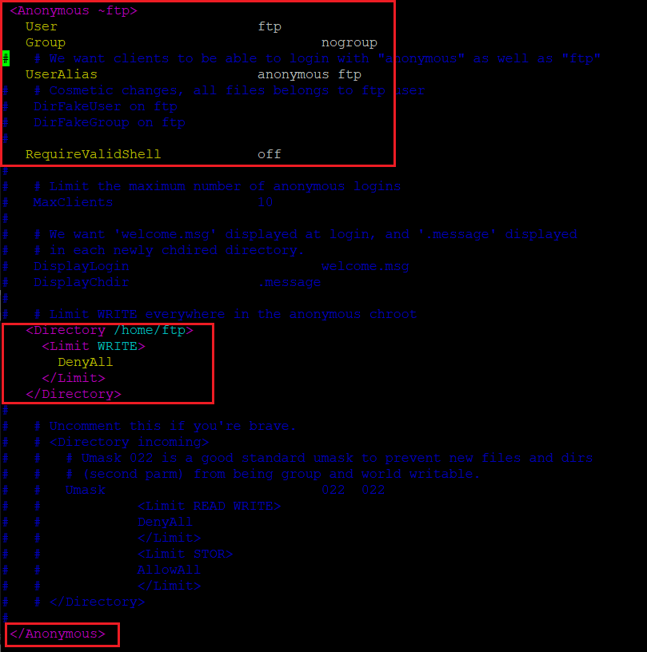

- 创建共享文件夹

    ```bash
    sudo mkdir ftp
    ```

- 更改用户共享目录

    ```bash
    sudo chown -R ftp:nogroup /home/ftp
    sudo usermod -d /home/ftp ftp
    ```

- 实现效果

    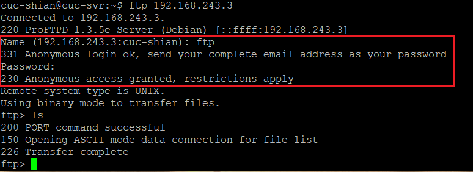


#### 配置一个支持用户名和密码方式访问的账号，该账号继承匿名访问者所有权限，且拥有对另1个独立目录及其子目录完整读写（包括创建目录、修改文件、删除文件等）权限

- 修改/etc/proftpd目录下的proftpd.conf文件

    ```bash
    sudo vim /etc/proftpd/proftpd.conf

    #添加以下内容
    AuthOrder mod_auth_file.c mod_auth_unix.c
    AuthUserFile /usr/local/etc/proftpd/passwd
    AuthGroupFile /usr/local/etc/proftpd/group
    PersistentPasswd off
    RequireValidShell off
    ```

- 使用ftpasswd创建passwd和group文件

    - 创建了一个user1和user2用户

        ```bash
        sudo ftpasswd --passwd --file=/usr/local/etc/proftpd/passwd --name=user1 --uid=1024 --home=/home/user1 --shell=/bin/false
        ```

    - 创建了一个virtualusers用户组

        ```bash
        sudo ftpasswd --file=/usr/local/etc/proftpd/group --group --name=virtualusers --gid=1024
        ```

    - 把user1和user2加入virtualusers组

        ```bash
        sudo ftpasswd --group --name=virtualusers --gid=1024 --member=user1 --member=user2 --file=/usr/local/etc/proftpd/group
        ```

- 修改/home/user1权限

    ```bash
    sudo chown -R 1024:1024 /home/user1
    sudo chmod -R 700 /home/user1
    ```

- 实现效果

    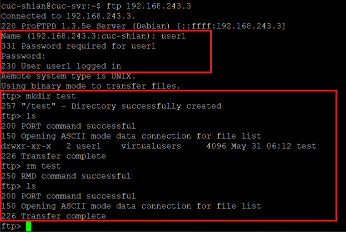

    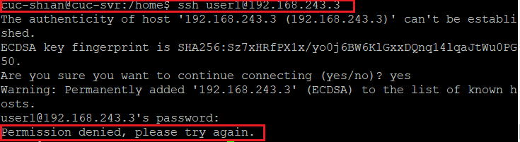


#### FTP用户不能越权访问指定目录之外的任意其他目录和文件

- 编辑/etc/proftpd目录下的proftpd.conf文件

    ```bash
    sudo vim /etc/proftpd/proftpd.conf
    ```

- 添加以下内容

    


#### 匿名访问权限仅限白名单IP来源用户访问，禁止白名单IP以外的访问

- 编辑 /etc/proftpd目录下的proftpd.conf文件

    ```bash
    sudo vim /etc/proftpd/proftpd.conf
    ```

- 添加以下内容，即IP在白名单中的192.168.243.4可以对ftp服务器进行访问，白名单外的IP不能访问

    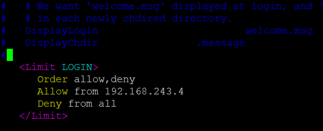

***

### NFS

#### 在1台Linux上配置NFS服务，另1台电脑上配置NFS客户端挂载2个权限不同的共享目录，分别对应只读访问和读写访问权限

- Host

    - IP：192.168.243.3

    - 配置NFS服务

        ```bash
        sudo apt-get update
        sudo apt-get install nfs-kernel-server
        ```

    - 创建一个用于挂载的（可读写）文件夹

        ```bash
        sudo mkdir /var/nfs/general -p
        sudo chown nobody:nogroup /var/nfs/general
        #另一个用于挂载的文件夹为/home（不可读写），不需要创建
        ```

    - 修改/etc/exports文件（即NFS服务的主要配置文件），添加以下内容

        ```bash
        /var/nfs/general 192.168.243.4(rw,sync,no_subtree_check)
        /home 192.168.243.4(sync,no_root_squash,no_subtree_check)
        ```

- Client

    - IP：192.168.243.4

    - 配置NFS服务

        ```bash
        sudo apt-get update
        sudo apt-get install nfs-common #创建相应的挂载文件
        sudo mkdir -p /nfs/general
        sudo mkdir -p /nfs/home #挂载文件夹
        sudo mount 192.168.243.3:/var/nfs/general /nfs/general
        sudo mount 192.168.243.3:/home /nfs/home
        ```

- 实现效果

    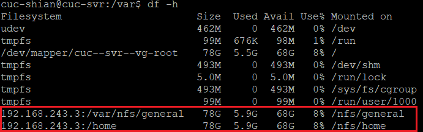

***

### DHCP

- Server

    - 编辑/etc/netplan/01-netcfg.yaml文件

        ```bash
        network:
        version: 2
        renderer: networkd
        ethernets:
            enp0s3:
                dhcp4: yes
                dhcp6: yes
            enp0s8:
                dhcp4: yes
                dhcp6: yes
                dhcp-identifier: mac
            enp0s9:
                dhcp4: no
                dhcp6: no
                dhcp-identifier: mac
                addresses: [192.168.57.1/24]
        ```

        - 使配置生效

            ```bash
            sudo netplan apply
            ```

        - 修改/etc/default/isc-dhcp-server文件

            ```bash
            INTERFACESv4="enp0s9"
            INTERFACESv6="enp0s9"
            ```

- Client

    - 编辑/etc/netplan/01-netcfg.yaml文件

        ```bash
        network:
        version: 2
        renderer: networkd
        ethernets:
            enp0s3:
                dhcp4: yes
                dhcp6: yes
            enp0s8:
                dhcp4: yes
                dhcp6: yes
                dhcp-identifier: mac
            enp0s9:
                dhcp4: yes
                dhcp6: yes
        ```

    - 使配置生效

            ```bash
            sudo netplan apply
            ```

    - 开启dhcp

***

### Samba

#### Server：Linux & Client：Windows

- 安装Samba服务器

    ```bash
    sudo apt-get install samba
    ```

- 创建Samba共享专用的用户

    ```bash
    sudo useradd -M -s /sbin/nologin smbuser
    sudo passwd smbuser
    ```

- 创建的用户必须有一个同名的Linux用户

    ```bash
    sudo smbpasswd -a smbuser
    ```

- 在/etc/samba/smb.conf 文件尾部追加以下“共享目录”配置，guest为匿名用户可以访问的目录（不可写），demo为虚拟用户才能访问的目录（可读写）

    ```bash
    [guest]
    path = /home/samba/guest/
    read only = yes
    guest ok = yes

    [demo]
    path = /home/samba/demo/
    read only = no
    guest ok = no
    force create mode = 0660
    force directory mode = 2770
    force user = smbuser
    force group = smbgroup
    ```

- 恢复一个samba用户

    ```bash
    sudo smbpasswd -e smbuser
    ```

- 创建用户组

    ```bash
    sudo groupadd smbgroup
    sudo usermod -G smbgroup smbuser
    ```


- 创建用于共享的文件夹并修改用户组

    ```bash
    mkdir -p /home/samba/guest/
    mkdir -p /home/samba/demo/
    sudo chgrp -R smbgroup /home/samba/guest/
    sudo chgrp -R smbgroup /home/samba/demo/
    sudo chmod 2775 /home/samba/guest/
    sudo chmod 2770 /home/samba/demo/
    ```

- 启动samba

    ```bash
    sudo smbd
    ```

- 在Windows上访问`\\192.168.243.3`

    

- demo文件夹需要用户名密码

    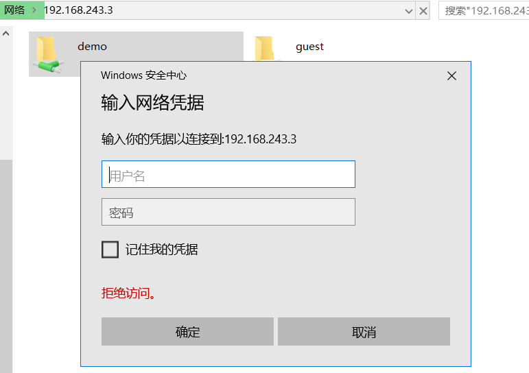

    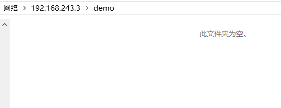

#### Server：Windows & Client：Linux

- Windows设置共享目录

    - 参考：[linux-public-JuliBeacon](https://github.com/CUCCS/2015-linux-public-JuliBeacon/blob/exp6/%E5%AE%9E%E9%AA%8C%206/%E5%9C%A8Linux%E5%92%8CWindows%E9%97%B4%E8%AE%BE%E7%BD%AE%E6%96%87%E4%BB%B6%E5%85%B1%E4%BA%AB.md)

- 下载安装smbclient

    ```bash
    sudo apt-get install smbclient
    ```

- 查看所有共享目录

    ```bash
    sudo smbclient -L 192.168.243.3 -U Dell
    ```

- 实现效果

    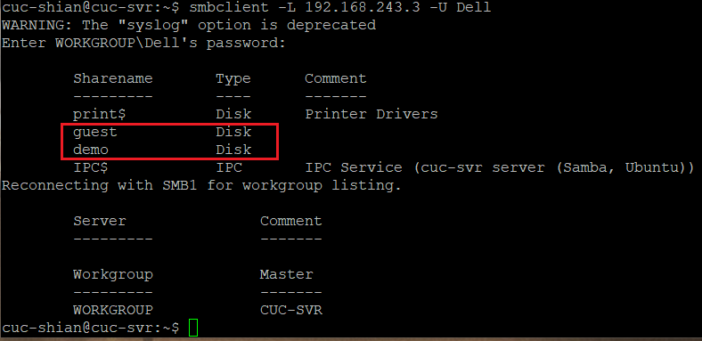

***

### DNS

- Server

    - 安装bind9

        ```bash
        sudo apt update
        sudo apt install bind9
        ```

    - 修改配置文件/etc/bind/named.conf.options

        ```bash
        #在options选项中添加以下配置
        listen-on { 192.168.243.4; };  # ns1 private IP address - listen on private network only
        allow-transfer { none; }; # disable zone transfers by default
        forwarders {
            8.8.8.8;
            8.8.4.4;
        };
        ```

    - 修改配置文件/etc/bind/named.conf.local

        ```bash
        #添加如下配置
        zone "cuc.edu.cn" {
            type master;
            file "/etc/bind/db.cuc.edu.cn";
        };
        ```

    - 创建保存域名解析的db文件

        ```bash
        sudo cp /etc/bind/db.local /etc/bind/db.cuc.edu.cn
        ```

    - 编辑配置文件/etc/bind/db.cuc.edu.cn

        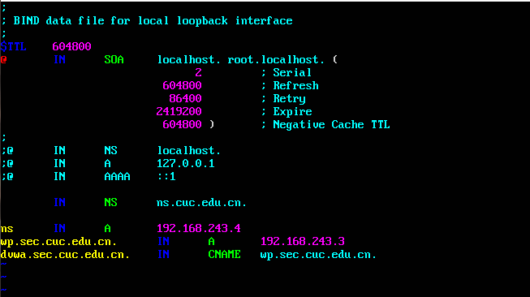

    - 重启bind9

        ```bash
        sudo service bind9 restart
        ```

- Client

    - 安装resolvconf

        ```bash
        sudo apt update
        sudo apt install resolvconf
        ```

    - 修改配置文件/etc/resolvconf/resolv.conf.d/head

        ```bash
        #添加配置
        search cuc.edu.cn
        nameserver 192.168.243.3
        ```

    - 更新resolv.conf文件

        ```bash
        sudo resolvconf -u
        ```

- 实现效果(未成功)

    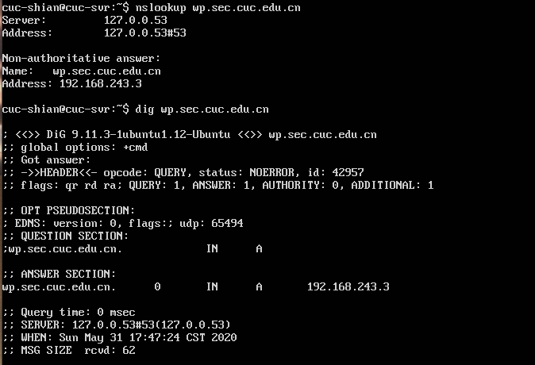

    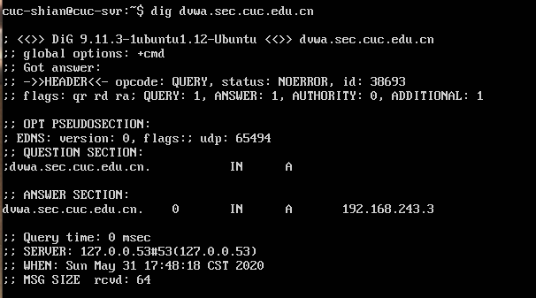

***

## 参考资料

- [linux/2017-1/TJY](https://github.com/CharleneTan/linux/blob/master/2017-1/TJY/网络资源共享/网络资源共享.md)

- [2015-linux-public-U2Vino](https://github.com/CUCCS/2015-linux-public-U2Vino/blob/HW-6/HW6-shell脚本编程练习进阶.md)

- [第六章：网络资源共享](https://c4pr1c3.github.io/LinuxSysAdmin/chap0x06.md.html)

- [第六章：shell脚本编程练习进阶（实验）](https://c4pr1c3.github.io/LinuxSysAdmin/chap0x06.exp.md.html)